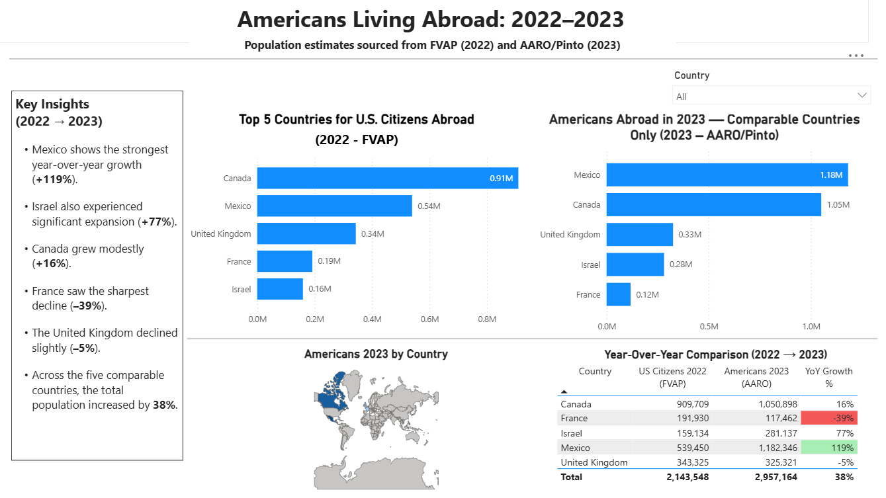
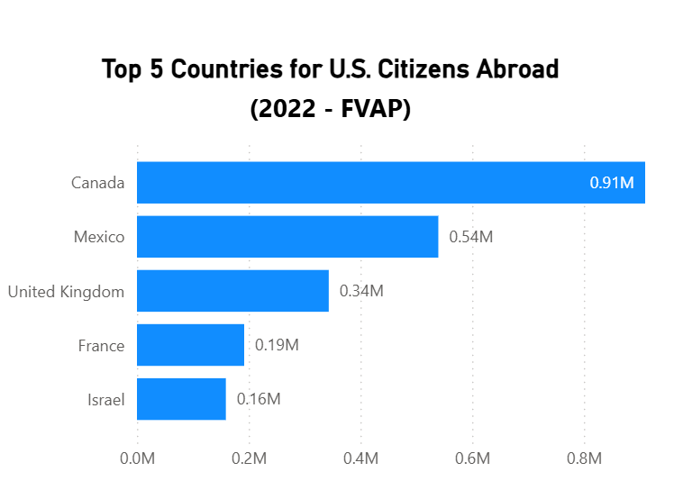
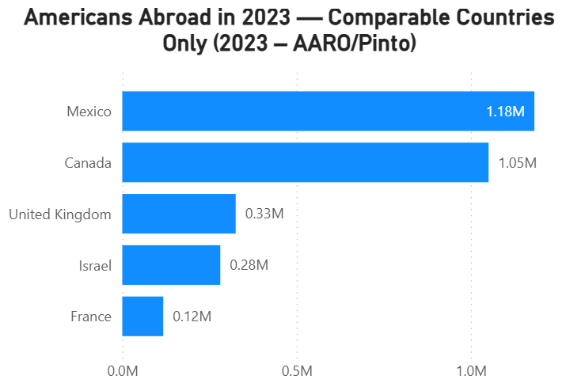
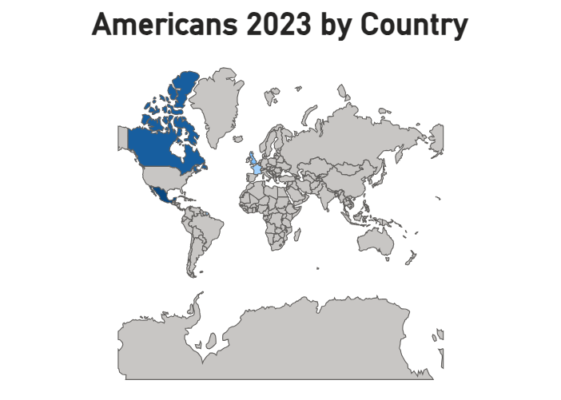
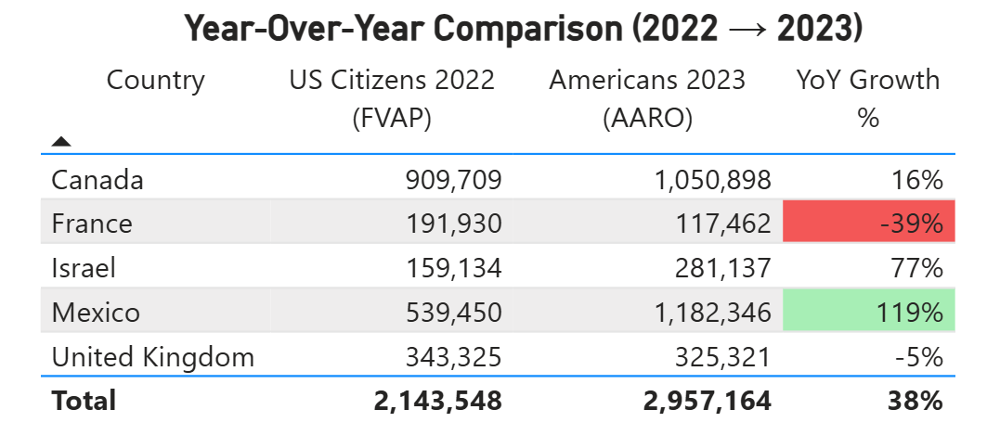

# 🇺🇸 Americans Living Abroad: Power BI Dashboard (2022–2023)

This project analyzes changes in the estimated number of Americans living abroad between **2022 (FVAP)** and **2023 (AARO/Pinto)**.  

It highlights year‑over‑year shifts, identifies countries with the strongest growth or decline, and visualizes the data through a clean, interactive Power BI dashboard.

---

## 📊 Full Dashboard Overview

---

## 🔍 Key Insights (2022 → 2023)

- **Mexico** shows the strongest year‑over‑year growth (**+119%**)  
- **Israel** also experienced significant expansion (**+77%**)  
- **Canada** grew modestly (**+16%**)  
- **France** saw the sharpest decline (**–39%**)  
- **United Kingdom** declined slightly (**–5%**)  
- Across the five comparable countries, the total population increased by **38%**

---

## 📈 2022: Top 5 Countries (FVAP)

---

## 📈 2023: Top 5 Countries (AARO/Pinto)

---

## 🗺️ 2023 Map View

---

## 📋 Year‑Over‑Year Comparison Table

---

## 📁 Data Sources

- **2022 Estimates:** Federal Voting Assistance Program (FVAP)  
- **2023 Estimates:** Association of Americans Resident Overseas (AARO) / Pinto Research  

---

## 🛠️ Tools Used

- **Power BI** — Data modeling, DAX, and visualization  
- **GitHub** — Version control and project documentation  
- **Excel / CSV** — Data preparation  

---

## 📌 About This Project

This dashboard is part of my analytics portfolio, demonstrating:

- Data cleaning and transformation  
- DAX calculations  
- Visual storytelling  
- Year‑over‑year analysis  
- Dashboard layout and design  

If you’d like to explore the dashboard further, the `.pbix` file is included in this repository.

